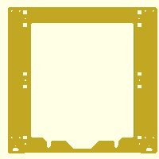

# Prusa3 frame (SCAD and DXF)

A replica of one of the Prusa i3 frames, but done entirely in OpenSCAD.

 

[Thingiverse](http://www.thingiverse.com/thing:1724953) and [Youmagine](https://www.youmagine.com/designs/prusa3-frame-scad-and-dxf).

License: [Creative Commons - Attribution - Non Commercial - Share Alike](https://creativecommons.org/licenses/by-nc-sa/4.0/)
